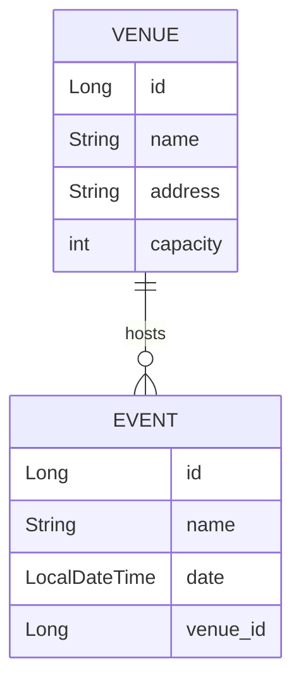

# HU4: Administración de Eventos y Venues (Relaciones)

Esta rama expande el modelo de dominio para incluir la entidad `Venue` (Lugar) y establece relaciones entre eventos y lugares, además de introducir la gestión de migraciones de base de datos con Flyway.

## Diagrama Entidad-Relación (ERD)



## Implementación Detallada

### 1. Entidad Venue y Relaciones
Se ha creado la entidad `Venue` y se ha relacionado con `Event`.

**Venue (`domain/model/Venue.java`)**:
```java
@Entity
@Table(name = "venues")
@Data
public class Venue {
    @Id
    @GeneratedValue(strategy = GenerationType.IDENTITY)
    private Long id;
    private String name;
    private String address;
    private Integer capacity;

    @OneToMany(mappedBy = "venue", cascade = CascadeType.ALL)
    private List<Event> events;
}
```

**Event (`domain/model/Event.java`)**:
Se añadió la relación `@ManyToOne`.
```java
@ManyToOne(fetch = FetchType.LAZY)
@JoinColumn(name = "venue_id")
private Venue venue;
```

### 2. Migraciones con Flyway
Se utiliza Flyway para gestionar el esquema de la base de datos de forma evolutiva.

*   `src/main/resources/db/migration/V1__init.sql`: Creación inicial de tablas.
*   `src/main/resources/db/migration/V2__add_venues.sql`: Creación de la tabla `venues` y alteración de `events` para añadir la clave foránea.

**Ejemplo de Script V2**:
```sql
CREATE TABLE venues (
    id BIGINT AUTO_INCREMENT PRIMARY KEY,
    name VARCHAR(255) NOT NULL,
    address VARCHAR(255),
    capacity INT
);

ALTER TABLE events ADD COLUMN venue_id BIGINT;
ALTER TABLE events ADD CONSTRAINT fk_event_venue FOREIGN KEY (venue_id) REFERENCES venues(id);
```

### 3. Optimización de Consultas
Se utiliza `FetchType.LAZY` en la relación `@ManyToOne` para evitar cargar el `Venue` innecesariamente cuando se consultan eventos, mejorando el rendimiento.