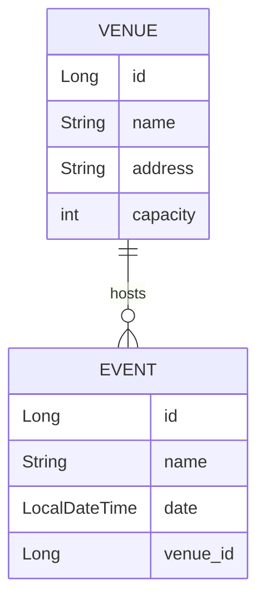

# HU4: Event & Venue Administration (Relationships)

This branch expands the domain model to include the `Venue` entity and establishes relationships between events and venues. It also introduces database migration management with Flyway.

## Entity-Relationship Diagram (ERD)



## Detailed Implementation

### 1. Venue Entity and Relationships
The `Venue` entity has been created and related to `Event`.

**Venue (`domain/model/Venue.java`)**:
```java
@Entity
@Table(name = "venues")
@Data
public class Venue {
    @Id
    @GeneratedValue(strategy = GenerationType.IDENTITY)
    private Long id;
    private String name;
    private String address;
    private Integer capacity;

    @OneToMany(mappedBy = "venue", cascade = CascadeType.ALL)
    private List<Event> events;
}
```

**Event (`domain/model/Event.java`)**:
Added the `@ManyToOne` relationship.
```java
@ManyToOne(fetch = FetchType.LAZY)
@JoinColumn(name = "venue_id")
private Venue venue;
```

### 2. Migrations with Flyway
Flyway is used to manage the database schema evolution.

*   `src/main/resources/db/migration/V1__init.sql`: Initial table creation.
*   `src/main/resources/db/migration/V2__add_venues.sql`: Creation of the `venues` table and altering `events` to add the foreign key.

**Example Script V2**:
```sql
CREATE TABLE venues (
    id BIGINT AUTO_INCREMENT PRIMARY KEY,
    name VARCHAR(255) NOT NULL,
    address VARCHAR(255),
    capacity INT
);

ALTER TABLE events ADD COLUMN venue_id BIGINT;
ALTER TABLE events ADD CONSTRAINT fk_event_venue FOREIGN KEY (venue_id) REFERENCES venues(id);
```

### 3. Query Optimization
`FetchType.LAZY` is used in the `@ManyToOne` relationship to avoid loading the `Venue` unnecessarily when querying events, improving performance.