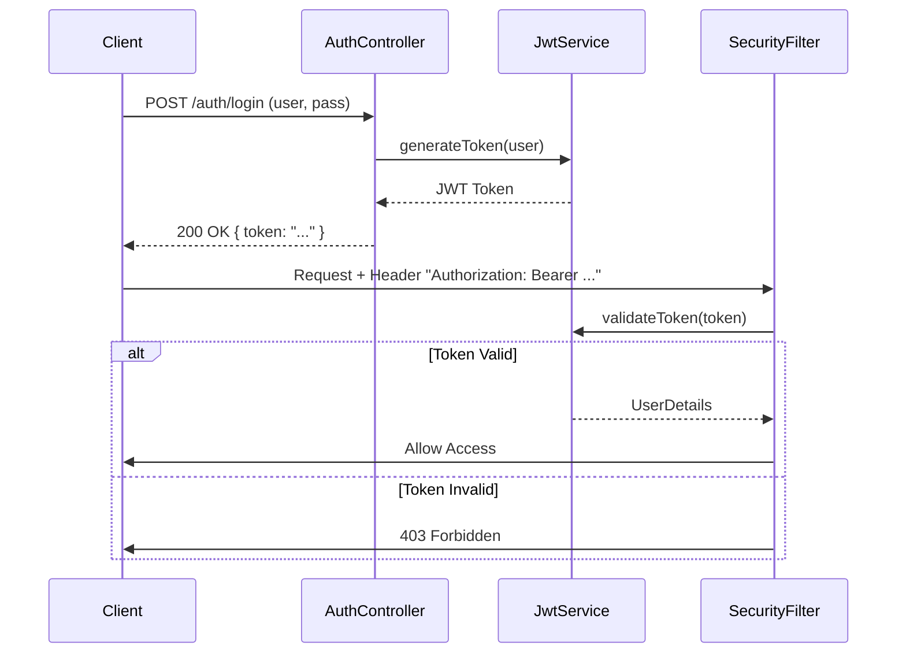

# HU5: Gestión Estándar de Errores y Seguridad JWT

Esta rama implementa un sistema robusto de seguridad basado en JWT (JSON Web Tokens) y un manejo global de excepciones estandarizado utilizando el RFC 7807 (Problem Details).

## Diagrama de Autenticación



## Implementación Detallada

### 1. Seguridad con Spring Security y JWT
Se ha configurado una arquitectura de seguridad *stateless*.

**Componentes Clave**:
*   `JwtAuthenticationFilter`: Intercepta cada petición para validar el token JWT en el encabezado `Authorization`.
*   `SecurityConfig`: Define la cadena de filtros y los permisos por ruta (ej. `/admin/**` solo para rol ADMIN).
*   `JwtService`: Clase utilitaria para crear, firmar y validar tokens usando la librería `jjwt`.

**Configuración de Seguridad (`infrastructure/config/SecurityConfig.java`)**:
```java
@Bean
public SecurityFilterChain securityFilterChain(HttpSecurity http) throws Exception {
    http
        .csrf(AbstractHttpConfigurer::disable)
        .authorizeHttpRequests(auth -> auth
            .requestMatchers("/auth/**").permitAll()
            .anyRequest().authenticated()
        )
        .sessionManagement(session -> session.sessionCreationPolicy(SessionCreationPolicy.STATELESS))
        .addFilterBefore(jwtAuthFilter, UsernamePasswordAuthenticationFilter.class);
    return http.build();
}
```

### 2. Manejo Global de Errores
Se utiliza `GlobalExceptionHandler` anotado con `@RestControllerAdvice` para capturar excepciones en toda la aplicación y transformarlas en respuestas JSON estructuradas.

**Formato de Respuesta (RFC 7807)**:
```json
{
  "type": "about:blank",
  "title": "Bad Request",
  "status": 400,
  "detail": "El campo 'nombre' no puede estar vacío",
  "instance": "/api/events"
}
```

**Clase `GlobalExceptionHandler` (`infrastructure/exception/GlobalExceptionHandler.java`)**:
```java
@RestControllerAdvice
public class GlobalExceptionHandler {
    @ExceptionHandler(MethodArgumentNotValidException.class)
    public ProblemDetail handleValidationErrors(MethodArgumentNotValidException ex) {
        ProblemDetail problem = ProblemDetail.forStatusAndDetail(HttpStatus.BAD_REQUEST, "Error de validación");
        // ... agregar detalles de campos
        return problem;
    }
}
```

## Pruebas de Seguridad
1.  **Registro**: `POST /auth/register`
2.  **Login**: `POST /auth/login` -> Recibir Token.
3.  **Acceso Protegido**: Usar el token en el header `Authorization: Bearer <token>`.