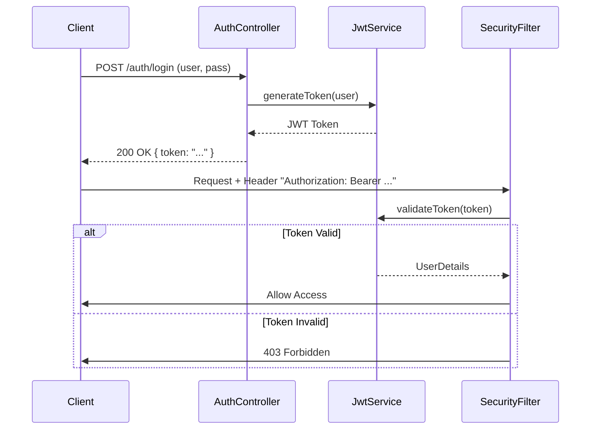

# HU5: Standardized Error Handling and JWT Security

This branch implements a robust security system based on JWT (JSON Web Tokens) and standardized global exception handling using RFC 7807 (Problem Details).

## Authentication Diagram



## Detailed Implementation

### 1. Security with Spring Security and JWT
A *stateless* security architecture has been configured.

**Key Components**:
*   `JwtAuthenticationFilter`: Intercepts every request to validate the JWT token in the `Authorization` header.
*   `SecurityConfig`: Defines the filter chain and route permissions (e.g., `/admin/**` only for ADMIN role).
*   `JwtService`: Utility class to create, sign, and validate tokens using the `jjwt` library.

**Security Configuration (`infrastructure/config/SecurityConfig.java`)**:
```java
@Bean
public SecurityFilterChain securityFilterChain(HttpSecurity http) throws Exception {
    http
        .csrf(AbstractHttpConfigurer::disable)
        .authorizeHttpRequests(auth -> auth
            .requestMatchers("/auth/**").permitAll()
            .anyRequest().authenticated()
        )
        .sessionManagement(session -> session.sessionCreationPolicy(SessionCreationPolicy.STATELESS))
        .addFilterBefore(jwtAuthFilter, UsernamePasswordAuthenticationFilter.class);
    return http.build();
}
```

### 2. Global Error Handling
A `GlobalExceptionHandler` annotated with `@RestControllerAdvice` is used to capture exceptions throughout the application and transform them into structured JSON responses.

**Response Format (RFC 7807)**:
```json
{
  "type": "about:blank",
  "title": "Bad Request",
  "status": 400,
  "detail": "The field 'name' cannot be empty",
  "instance": "/api/events"
}
```

**Class `GlobalExceptionHandler` (`infrastructure/exception/GlobalExceptionHandler.java`)**:
```java
@RestControllerAdvice
public class GlobalExceptionHandler {
    @ExceptionHandler(MethodArgumentNotValidException.class)
    public ProblemDetail handleValidationErrors(MethodArgumentNotValidException ex) {
        ProblemDetail problem = ProblemDetail.forStatusAndDetail(HttpStatus.BAD_REQUEST, "Validation Error");
        // ... add field details
        return problem;
    }
}
```

## Security Testing
1.  **Register**: `POST /auth/register`
2.  **Login**: `POST /auth/login` -> Receive Token.
3.  **Protected Access**: Use the token in the header `Authorization: Bearer <token>`.