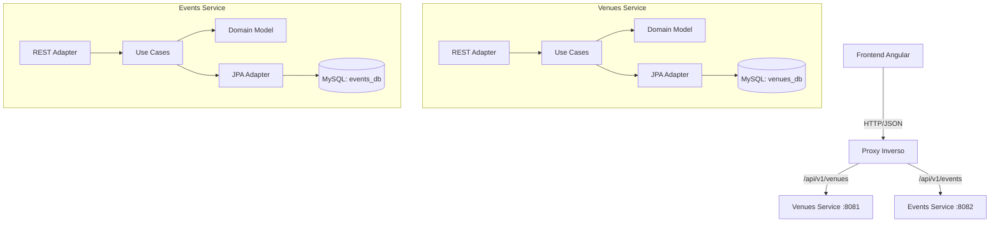

# Documentación del Proyecto Ticketing App

## 1. Descripción General
**Ticketing App** es una aplicación web moderna para la gestión de eventos y lugares (venues). Originalmente diseñada como un monolito, ha sido refactorizada exitosamente a una **Arquitectura de Microservicios** para mejorar su escalabilidad, mantenibilidad y separación de responsabilidades.

El sistema permite a los administradores:
- Crear, listar, editar y eliminar Lugares (Venues).
- Crear, listar, editar y eliminar Eventos (Events) asociados a esos lugares.

## 2. Arquitectura Técnica

### Estilo Arquitectónico
El backend sigue una **Arquitectura Hexagonal (Ports and Adapters)** distribuida en microservicios. Esto significa que la lógica de negocio (Dominio) está aislada del mundo exterior (Base de datos, API REST, UI).



### Tecnologías
- **Backend**: Java 17, Spring Boot 3.x, Maven (Multi-module).
- **Frontend**: Angular 17+, TypeScript, TailwindCSS (si aplica) o CSS nativo.
- **Base de Datos**: MySQL 8.0 (bases de datos independientes por servicio).
- **Comunicación**: REST (HTTP).

## 3. Estructura del Código

El proyecto se divide en dos grandes directorios:

### Backend (`/backend`)
Estructurado como un proyecto Maven multi-módulo:
- **`ticketing-backend` (Parent)**: Gestiona dependencias comunes.
- **`venues-service`**: Microservicio de lugares.
- **`events-service`**: Microservicio de eventos.

Dentro de cada microservicio, seguimos la estructura hexagonal:
- **`domain`**:
    - `model`: Entidades puras de Java (POJOs) como `Venue` o `Event`.
    - `ports`: Interfaces que definen los contratos (ej. `VenueRepositoryPort`, `CreateVenueUseCase`).
- **`application`**:
    - `usecase`: Implementación de la lógica de negocio (ej. `CreateVenueService`). Orquesta el flujo de datos.
- **`infrastructure`**:
    - `adapters/in/web`: Controladores REST (`VenueRestAdapter`). Reciben peticiones HTTP y llaman a los casos de uso.
    - `adapters/out/persistence`: Implementación de repositorios con Spring Data JPA (`VenueJpaAdapter`). Guardan datos en MySQL.
    - `config`: Configuración de Beans de Spring (`BeanConfiguration`).

### Frontend (`/frontend`)
Aplicación Angular estándar:
- **`src/app/core`**: Servicios (`venue.service.ts`, `event.service.ts`) y modelos.
- **`src/app/features`**: Componentes visuales organizados por funcionalidad (`venues-list`, `event-form`, etc.).
- **`proxy.conf.json`**: Configuración crítica que redirige las llamadas API a los puertos correctos del backend (8081 y 8082).

## 4. Guía de Ejecución

### Prerrequisitos
- Java 17+
- Maven
- Node.js y npm
- MySQL Server corriendo (puerto 3306)

### Paso 1: Iniciar el Backend
Hemos facilitado un script para arrancar ambos microservicios simultáneamente.

1. Abrir una terminal en la carpeta `backend`.
2. Ejecutar:
   ```bash
   ./start-services.sh
   ```
   *Esto iniciará `venues-service` en el puerto 8081 y `events-service` en el puerto 8082 en segundo plano.*

### Paso 2: Iniciar el Frontend
1. Abrir una nueva terminal en `frontend/ticketing-frontend`.
2. Ejecutar:
   ```bash
   npm start
   ```
3. Acceder a la aplicación en el navegador: `http://localhost:4200`

## 5. Explicación del Flujo de Datos (Ejemplo: Crear Evento)

1. **Usuario**: Llena el formulario en Angular y hace clic en "Guardar".
2. **Frontend**: `EventService` envía un POST a `/api/v1/events`.
3. **Proxy**: Redirige la petición a `http://localhost:8082/api/v1/events`.
4. **Events Service (Controller)**: `EventRestAdapter` recibe el JSON, lo valida y lo convierte a un objeto de dominio `Event`.
5. **Events Service (UseCase)**: `CreateEventService` recibe el objeto.
   - Asigna fecha de creación.
   - Valida reglas de negocio.
6. **Events Service (Repository)**: `EventJpaAdapter` convierte el objeto de dominio a una entidad JPA (`EventEntity`) y lo guarda en la tabla `events` de `events_db`.
7. **Respuesta**: El ID generado se devuelve al frontend, que muestra un mensaje de éxito.
